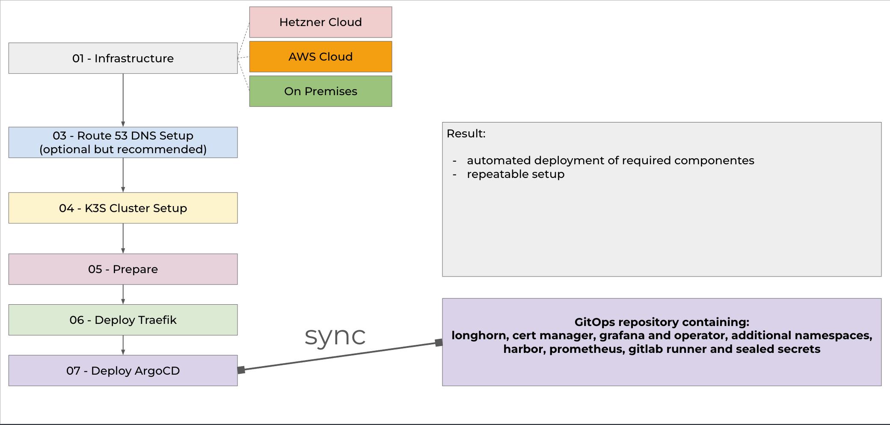
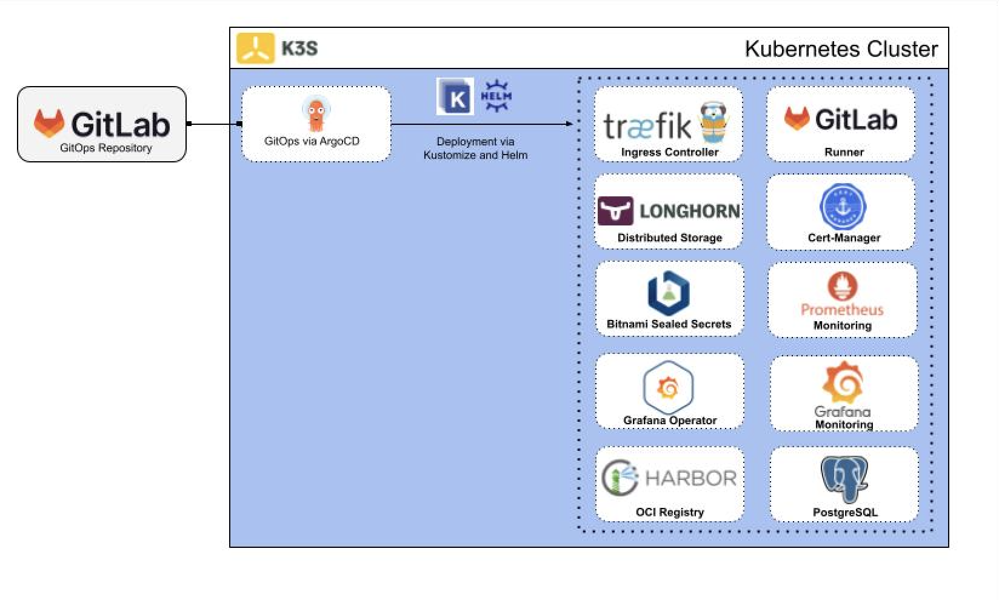
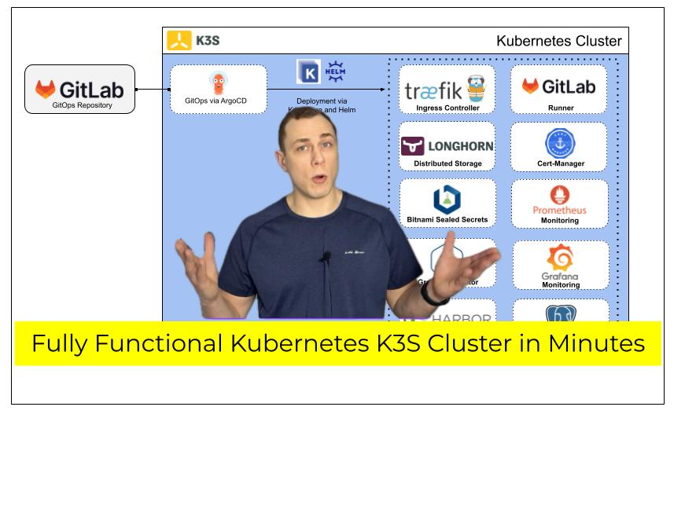
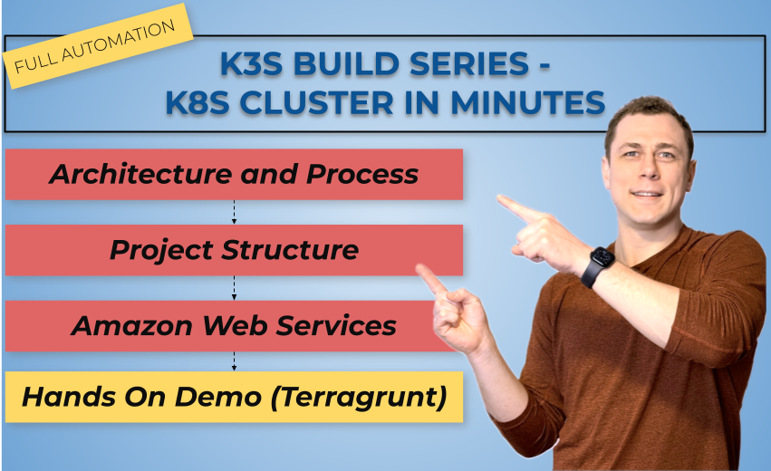

# 🤝 Connect with the Author

| Platform       | Link       |
|----------------|----------------|
| LinkedIn  | https://www.linkedin.com/in/dimitrij-malcev |
| YouTube Channel  | https://www.youtube.com/@DimitrijMalcev |
| Website  | https://www.malcev-consulting.com |

# Cloud-Agnostic K3S Cluster with GitOps 

This repository contains the IaC (Terragrunt with Terraform) for setting up a ready cluster based on K3S using Amazon Web Services Cloud Services, Hetzner Cloud or On-Premise (local setup) and connecting GitOps to provision the required Applications and Services for development. 

##  Development

🔧 The project is actively evolving, and more code and videos will be added in the near future.  
✅ Make sure to subscribe on <b>YouTube</b> and follow on <b>LinkedIn</b> to stay updated and not miss any new content.

# Disclaimer

This repository and the included code are provided for demonstration, testing, and educational purposes only. Use of this code is at your own risk. No warranties are provided regarding its functionality, correctness, security, or suitability for production environments. In particular, when deploying in cloud or on-premises infrastructure, it is strongly recommended to review, adapt, and test the code thoroughly in a safe and isolated environment before using it in production. Organizations or individuals intending to use this code in commercial or sensitive environments do so at their own discretion and are responsible for ensuring compliance with their internal security, legal, and operational requirements.

The author accepts no liability for any damages, outages, data loss, or costs resulting from the use of this code.

# Architecture 

## Terragrunt Process

## K3S Cluster

# Video Series

| Video-Link       | Context       | Title       |
|----------------|----------------|----------------|
|   | 01 - Introduction  | <i>Fully Functional K3S Cluster using Terraform with GitOps and CI/CD (Cloud-Agnostic)</i>  |
|  |  02 - Architecture | <i>Enterprise Kubernetes in Minutes - Fully Automated with Terragrunt</i>  |
| upcoming |  03 - Project Setup and Hetzner Cloud Infrastructure | <i>upcoming</i>  |

# Prerequisites

- Terraform and Terraform required in your environment (see: https://developer.hashicorp.com/terraform/tutorials/aws-get-started/install-cli and https://terragrunt.gruntwork.io/docs/getting-started/install/) (tested with Terraform v1.5.7 and Terragrunt version 0.77.7)
- AWS CLI with a valid profile (if you want to use SSM-Parameter Store for fetching Secrets and provisioninig AWS resources)
- Git
- A Valid Hetzner Cloud Account with a Token
- SSH Public Key

# Using this code
1. Configure the environment (development) under `envs/dev/env.hcl` and the general project configuration under `root.hcl` 
2. To provision the resources using terragrunt: `bash execution/apply-dev.sh`   (for the development environment)
3. To destroy the resources using terragrunt: `bash execution/destroy-dev.sh`  (for the development environment)
4. Optionally configure additional environments

# 🛣️ Roadmap and Scope

This roadmap delineates the sequential steps involved in provisioning and managing a K3S cluster across various environments using Terragrunt and GitOps methodologies.

## Infrastructure Provisioning with Terragrunt

- <b>Modular Configuration:</b> Utilize Terragrunt to manage and orchestrate Terraform modules, promoting reusability and maintainability.
- <b>Environment-Specific Setups:</b> Define configurations for different environments (e.g., AWS, Hetzner Cloud, On-Premises) to facilitate targeted deployments.
- <b>Dependency Management:</b> Leverage Terragrunt's capabilities to handle dependencies between modules, ensuring resources are provisioned in the correct order.

## K3S Cluster Deployment

- <b>Lightweight Kubernetes:</b> Deploy K3S, a lightweight Kubernetes distribution, suitable for edge and development environments.

- <b>Automated Installation:</b> Automate the installation process to streamline cluster setup across different infrastructures.

## GitOps Integration
- <b>Declarative Configurations:</b> Store Kubernetes manifests and Helm charts in a Git repository to serve as the single source of truth.
- <b>Continuous Deployment:</b> Implement GitOps (Argo CD) to monitor the repository and apply changes to the cluster automatically.

## Application and Service Deployment
-  <b>Helm Charts:</b> Use Helm to package and deploy applications, simplifying the management of Kubernetes resources.
- <b>Integrate Critical Components:</b> Integrate all the required components with GitOps Deployments (GitLab CI, Storage, etc.).
- <b>Monitoring and Logging</b> Integrate monitoring (e.g., Prometheus, Grafana) and logging solutions to observe cluster health and performance.

## Ongoing Maintenance and Scaling
- <b>Infrastructure Updates:</b> Regularly update Terraform modules and Terragrunt configurations to incorporate improvements and address issues.
- <b>Dynamic Environments:</b> Realization of dynamic environments.
- <b>Cluster Scaling:</b> Adjust the number of nodes and resources in the K3S cluster to accommodate changing workloads.
- <b>Security Enhancements:</b> Implement security best practices, including regular audits, to protect the cluster and applications.